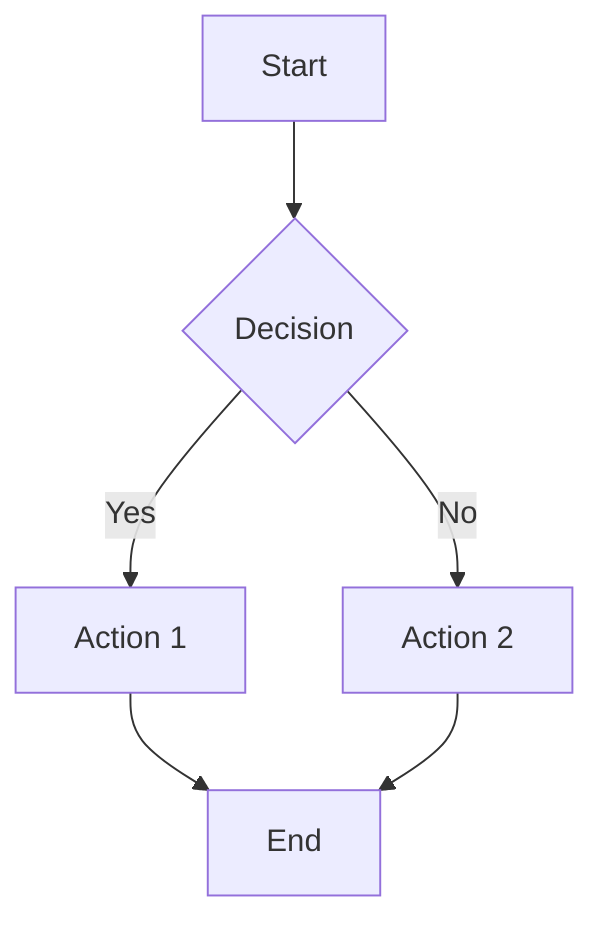
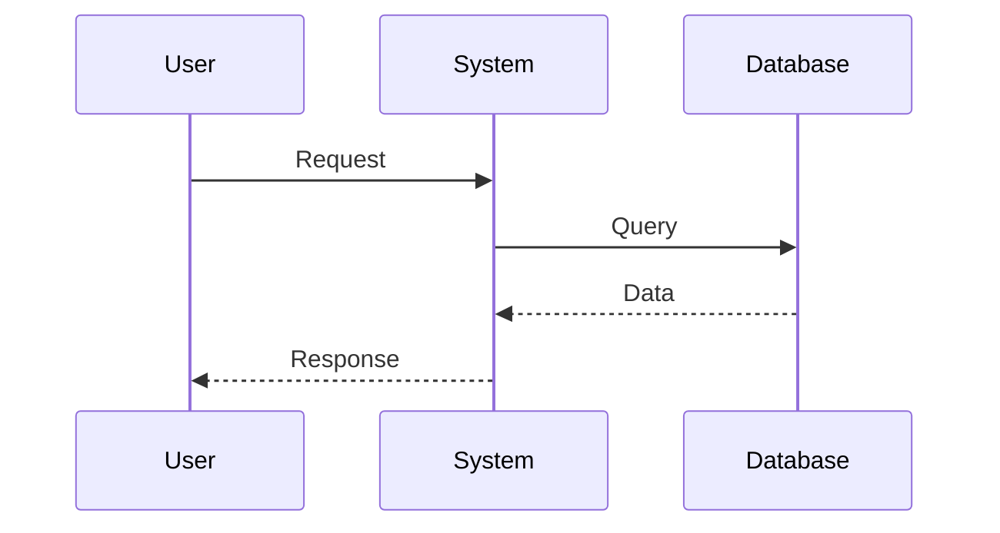
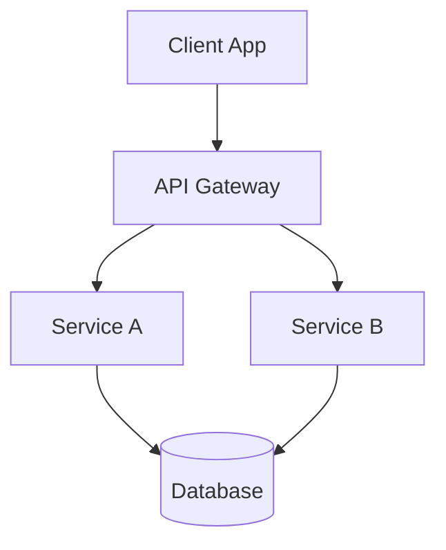

# Technical Writing

## Principios Fundamentales

1. **Claridad**: Ser directo y preciso
2. **Concisión**: Sin palabras innecesarias
3. **Estructura**: Organización lógica
4. **Ejemplos**: Ilustrar con código real

---

## SDD (Specification Design Document)

### Estructura

```markdown
# SDD: [Título de Feature]

## 1. Contexto y Motivación
[Breve descripción del problema o necesidad]

## 2. Análisis de Alternativas
- Opción A: [descripción]
  - Pros: [...]
  - Contras: [...]
- Opción B: [descripción]
  - Pros: [...]
  - Contras: [...]
- **Decisión**: [razón de la elección]

## 3. Diseño Detallado

### 3.1 Arquitectura
[Diagrama si aplica]

### 3.2 Componentes Afectados
- Componente A: [responsabilidad]
- Componente B: [responsabilidad]

### 3.3 Schema de Datos
```typescript
interface NuevoTipo {
  campo1: string;
  campo2?: number;
}
```

### 3.4 APIs
```typescript
// Nuevo endpoint/función
function nuevaFuncion(param: string): Promise<Resultado>;
```

## 4. Plan de Implementación
1. [Paso 1]
2. [Paso 2]
3. [Paso 3]

## 5. Tests de Validación
- [ ] Test 1
- [ ] Test 2

## 6. Consideraciones
- [ ] Seguridad
- [ ] Rendimiento
- [ ] Accesibilidad
- [ ] Backwards Compatibility

## 7. Riesgo y Mitigación
| Riesgo | Impacto | Mitigación |
|--------|---------|------------|
| [Riesgo 1] | [Alto/Medio/Bajo] | [Estrategia] |
```

---

## Guía de Estilo

### Lenguaje

- ✅ Usar voz activa
- ✅ Usar tiempo presente
- ✅ Ser directo

```
✅ The function validates the input.
❌ The input will be validated by the function.
```

### Encabezados

- Solo un H1 por documento
- H2 para secciones principales
- H3 para subsecciones
- No saltar niveles

### Código

- Usar fenced code blocks
- Especificar lenguaje
- Comments en código cuando necesario

````markdown
```typescript
const example = "code";
```
````

### Listas

- Usar bullets para items sin orden
- Usar números para pasos/prioridad
- Ser consistente

---

## Documentación de Código

### JSDoc (si aplica)

```typescript
/**
 * Calculates the sum of two numbers.
 * 
 * @param a - The first number
 * @param b - The second number
 * @returns The sum of a and b
 * 
 * @example
 * ```typescript
 * sum(2, 3) // returns 5
 * ```
 */
function sum(a: number, b: number): number {
  return a + b;
}
```

### README de Componentes

```markdown
## ComponentName

Brief description of what this component does.

### Props

| Prop | Type | Default | Description |
|------|------|---------|-------------|
| `title` | `string` | - | Required title |
| `onSave` | `() => void` | `undefined` | Callback on save |

### Usage

```tsx
<ComponentName 
  title="Hello"
  onSave={() => console.log('saved')}
/>
```

### Notes
- [Note 1]
- [Note 2]
```

---

## Documentación de API

### Endpoint

```markdown
### POST /api/users

Creates a new user.

**Request Body**
```json
{
  "name": "John",
  "email": "john@example.com"
}
```

**Response (201)**
```json
{
  "id": "123",
  "name": "John",
  "email": "john@example.com"
}
```

**Error Response (400)**
```json
{
  "error": "Invalid email format"
}
```
```

---

## Diagramas Mermaid

### Flujo



### Secuencia



### Arquitectura



---

## Errores Comunes

### Demasiada Explicación

```markdown
❌ The system will first check if the user has provided a valid email address by means of running a regular expression against the input to ensure it matches the standard email pattern.

✅ The system validates the email format.
```

### Vaguedad

```markdown
❌ This feature improves performance.

✅ This feature reduces initial load time by 40% through code splitting.
```

### Inconsistencia

```markdown
❌ userId, user_id, user-ID

✅ userId throughout the document
```

---

## Revisión de Documentación

### Checklist

- [ ] ¿El título es claro y descriptivo?
- [ ] ¿La estructura es lógica?
- [ ] ¿Hay ejemplos donde sea útil?
- [ ] ¿El código está actualizado?
- [ ] ¿Hay diagramas donde ayude?
- [ ] ¿Ortografía y gramática correctas?
- [ ] ¿Es conciso?
